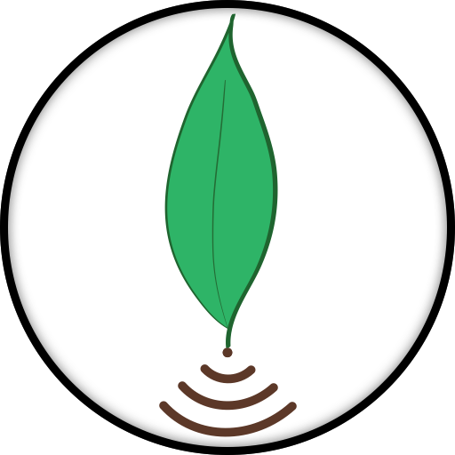
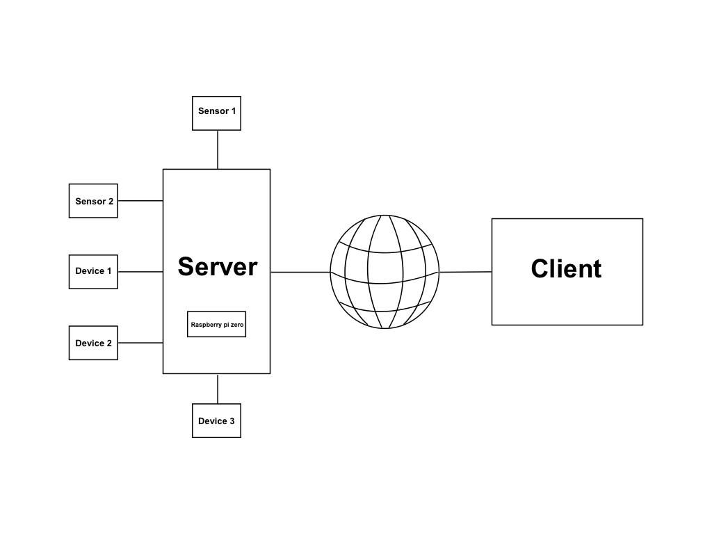
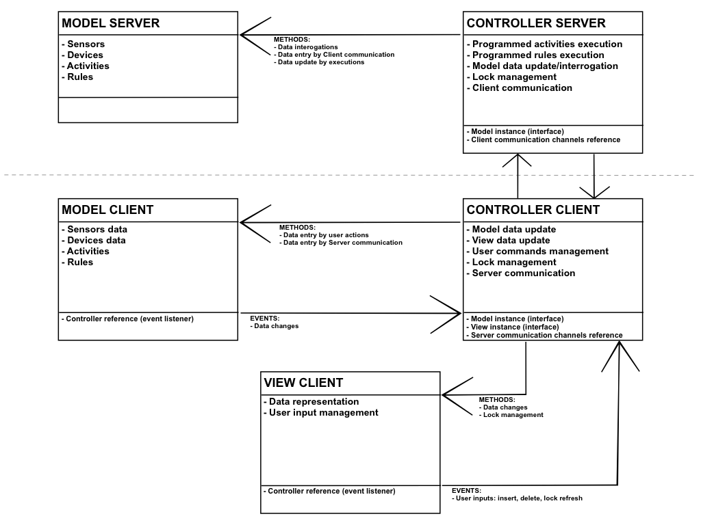

# P.I.G.
"Project IoT Greenhouse", progetto per il corso 'Programmazione Avanzata Java e C' di 'Ingegneria Informatica' presso l'Università del studi di Brescia.

## Indice
* [Obiettivo](#Obiettivo)
* [Struttura base](#Struttura-base)
* [Funzionalità](#Funzionalità)
* [Elementi base](#Elementi-base)
    * [Sensori](#Sensori)
    * [Dispositivi](#Dispositivi)
    * [Azioni](#Azioni)
    * [Attività](#Attività)
    * [Regole](#Regole)
* [Modello MVC](#Modello-MVC)
* [Protocollo di comunicazione](CommunicationProtocol.md)

## Obiettivo
Progettare ed implementare una serra automatica adatta ad un contesto casalingo, adoperabile quindi per il mantenimento e la cura di poche piante in vaso e con spazi contenuti.

## Struttura base
L’idea prevede un’architettura client-server: dove il server è posto direttamente sulla struttura che compone la serra e direttamente collegato a sensori e dispositivi per la gestione; mentre il client è disponibile sui dispositivi utente, in numero anche maggiore di uno contemporaneamente, per la visualizzazione dello stato della serra e la pianificazione di attività o regole.
Il linguaggio di programmazione adoperato è Java, sia per il server che per il client.
Per il server si ritiene sufficiente l’uso di un Raspberry pi zero come elaboratore ed utilizzare le connessioni GPIO integrate per la connessione degli strumenti necessari.
Tuttavia, dovendo presentare il progetto in ambito universitario si prevede di realizzare un ambiente emulato della serra. In questo modo è semplice la presentazione del programma funzionante.

## Funzionalità
Si ricorda il contesto di questo progetto, ovvero casalingo.
Le funzionalità, perciò, pensate che la serra rende disponibili sono quelle elementari:

* Controllo della temperatura
* Controllo del livello dell’acqua
* Azionare una lampada UV
* Azionare ventole per il ricircolo dell’aria
* Azionare termoresistenze per regolare la temperatura
* Azionare una pompa per l’irrigazione

L’utente può pianificare l’esecuzione di una delle ultime quattro azioni impostando data, durata ed una ripetizione.
Ultima funzione è la possibilità di impostare regole di confronto sui dati dei sensori per automatizzare alcune procedure (impostare attività, eliminare attività, emettere avvisi).

## Elementi base
Qui di seguito vengono spiegati alcuni elementi base necessari alla comprensione della progettazione seguente.

### Sensori
I sensori sono accessori collegati al server e posti direttamente sulla serra. Il loro scopo è fornire dati sullo stato della serra e nulla di più.
Attualmente sono previsti solo due sensori:

* Sensore di temperatura interna alla serra
* Sensore di livello dell’acqua per il serbatoio

Fattore comune tra essi è l’unica interazione di interesse che si ha con il server: il recupero del dato.
Per questo motivo l’implementazione a programma dei sensori avviene tramite un’interfaccia che accomuna le caratteristiche principali e consente alle procedure del server di lavorare con una sola classe: l’interfaccia stessa.
Questa strategia pone un vincolo sulle funzionalità dei sensori, ma semplifica l’aggiunta e la gestione di un nuovo modello o tipo con l’aggiunta di una nuova classe apposita senza dover modificare il programma stesso.
Le caratteristiche in comune rilevate sono:

* Identificativo oggetto
* Dato rilevato

Queste caratteristiche base possono variare nell'implementazione su Client e Server.
Ogni sensore ha poi una classe apposita, in cui specificare altri dati utili al funzionamento (esempio: con Raspberry i GPIO di funzionamento).

### Dispositivi
I dispositivi sono accessori collegati al server e posti direttamente sulla serra. Il loro scopo è eseguire determinate azioni per modificare lo stato della serra.
Previsti per il progetto sono i dispositivi:

* Lampada UV
* Ventola di aerazione
* Termoresistenza
* Elettropompa per irrigazione

Ognuno ha un diverso modo di alimentazione e di controllo, nello specifico caso di server con Raspberry questo può avvenire tramite scheda relé per poter decidere quando e come alimentare l’elemento.
Anche per questo accessorio si utilizza la stessa strategia usata per i sensori: un’interfaccia che racchiude le caratteristiche comuni.
Questo raggruppamento avrà quindi:

* Identificativo oggetto
* Stato dispositivo (intero per poter esprimere diversi tipi di stato)

Ognuno dei dispositivi avrà una classe apposita con un prefissato elenco di azioni disponibili (queste non variano dinamicamente in esecuzione).

### Azioni
Un’azione è il cambiamento di stato per un dispositivo. Questo stato è definito e fissato.
Ogni elemento avrà un proprio elenco scolpito a codice e non variante durante l’esecuzione del programma. Le classi definite per descrivere un’azione sono quindi costanti e semplicemente utilizzate come “metodi” da processare con una descrizione da mostrare a video [Lato Client].
Anche per le azioni si definisce un’interfaccia con le caratteristiche:

* Identificativo oggetto
* Descrizione da mostrare a video [solo Client]
* Stato in cui portare il dispositivo
* Azione di temine

la quale esploderà in una classe interna al dispositivo per ognuna in elenco.
La caratteristica “Azione di termine” è necessaria per un discorso di attività spiegato in seguito.

### Attività
Un’attività è la pianificazione di un’azione su un determinato dispositivo da un detto istante e da ripetere ogni quanto di tempo specificato.
Questa pianificazione ha quindi una data ed ora scelta dall’utente con la possibilità di impostare una durata in termini di tempo. La meccanica della lunghezza temporale per un’attività è collegata alla caratteristica “Azione di termine” prevista per le azioni, infatti, essa identifica l'azione da eseguire una volta terminata la durata indicata.
Necessario è prevedere una ripetizione per l’attività, ovvero definire ogni quanti giorni/ore/minuti eseguire nuovamente l’azione.
Caratteristiche di questo elemento sono quindi:

* Dispositivo considerato
* Azione da eseguire
* Data e ora esecuzione
* Durata
* Ripetizione (ed unità di misura)

### Regole
Le regole sono strumenti per automatizzare in base a determinate condizioni della serra l’esecuzione di azioni sui dispositivi.
L’effetto è quindi di impostare azioni su un dispositivo in conseguenza a valori letti dai sensori disponibili, con confronti di uguaglianza (=), maggioranza (>) o minoranza (<) ad un valore dato.
La logica è di avviare l'azione dal momento che si presenta lo stato specificato della serra e questa è “spenta” altrimenti.
Questo modo di pensare permette di suddividere gli interventi sulla serra in elementi atomici e realizzare funzioni più complesse.
Le caratteristiche per una regola si riassumono in:

* Sensore di riferimento
* Comparatore
* Dato da comparare
* Azione da eseguire

## Modello MVC
È qui riportato lo schema per il modello MVC utilizzato per la progettazione dei programmi server e client:

Come si nota, i programmi sono due: uno per l’esecuzione server e l’altro per il client.
La suddivisione comporta di dover scegliere se implementare classi ed interfacce comuni o distinte; la scelta effettuata è di sviluppare due programmi distinti senza parti comuni (ad eccezione di qualche classe di utilità).
In questo modo non si avranno sacrifici di prestazioni. Tuttavia, è così necessario essere certi di eseguire la stessa versione di rilascio.
